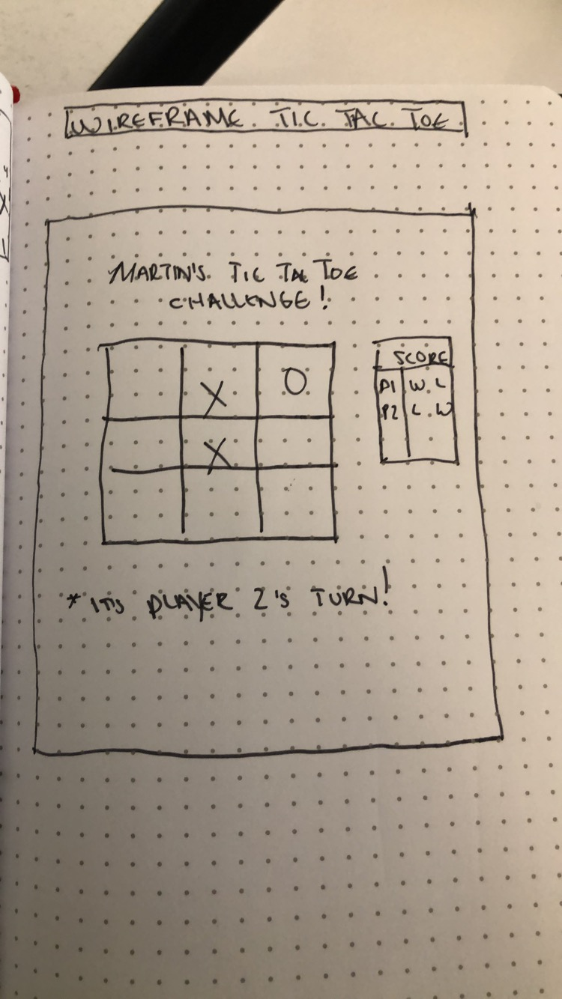
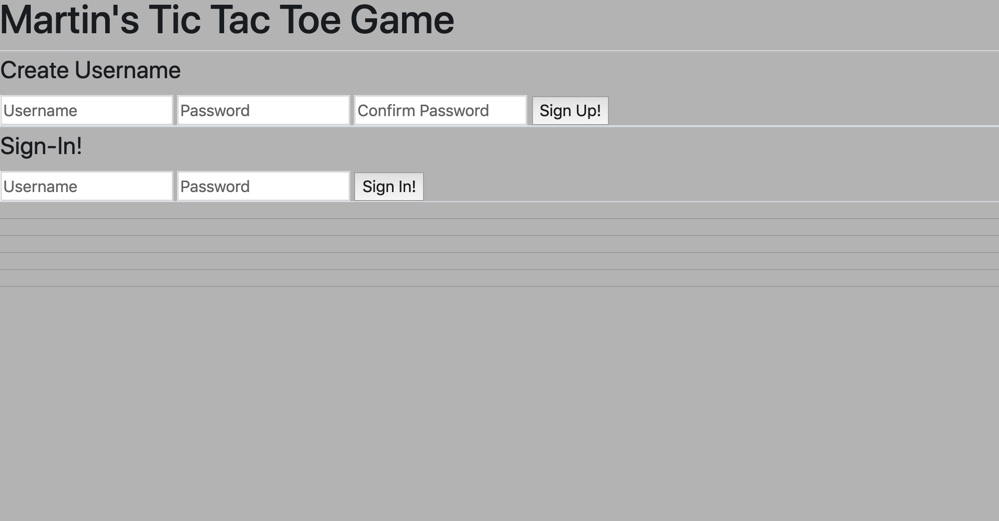
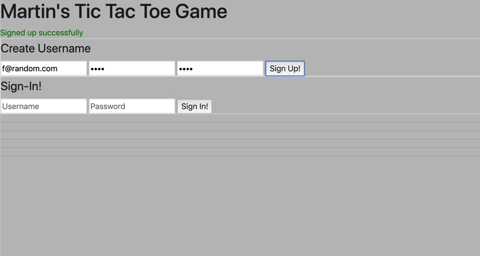
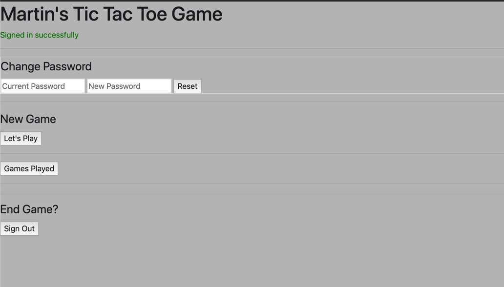
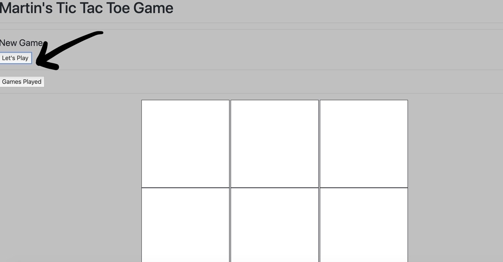
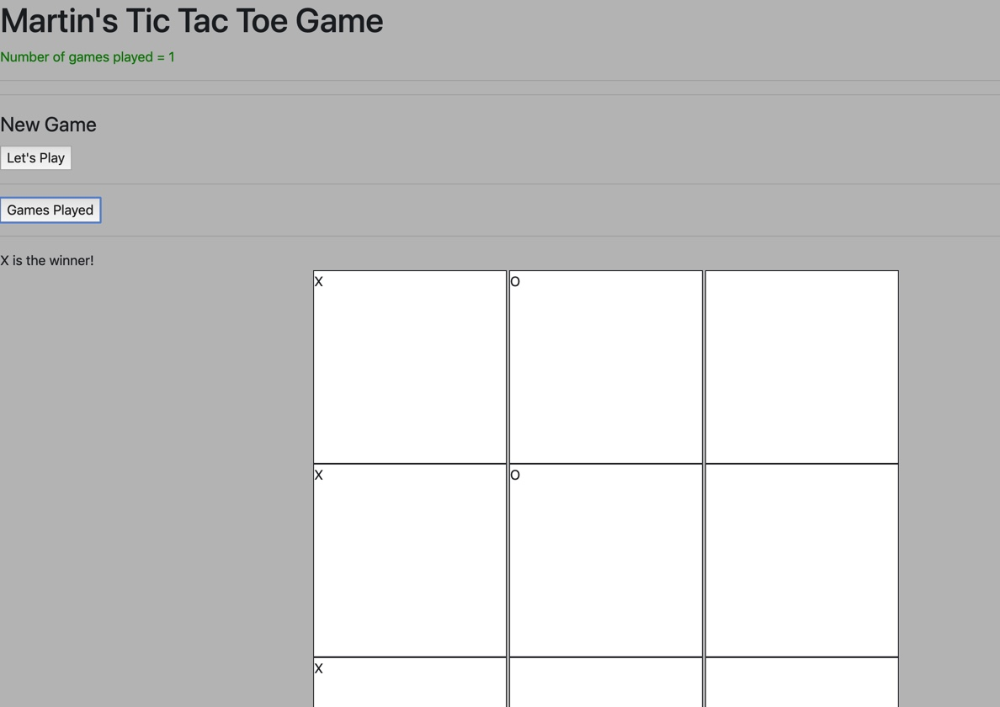

# Tic-Tac-Toe
### By: Martin Rodriguez

## Description
```
Tic-tac-toe is a full stack project that uses HTML & CSS for
layout and styling, and Javascript for the game logic. A(n) SPA,
the game is intended for single player use only, but with two
different outputs, can easily become a two-player session. A
player can create a username and password, login/sign-out, change
their password, and keep track of games played under that
username.
```
## User Stories
```
As a user, I want the ability to create a username
As a user, I want the ability to log in
As a user, I want the ability to change my password
As a user, I want the ability to see the amount of games played
by me
As a user, I want the ability to win with either 'X' or 'O'
As a user, I want the ability to draw other than winning and
losing
As a user I want the ability to navigate from and to the page,
without losing my username
As a user I want the ability to restart the game whenever I
choose
```

## Wireframe and Game Pictures
```
Wireframe
```

```
Initial launch of Tic Tac Toe
```

```
Sign Up
```

```
Sign In & Sign Out
```

```
Play a Game
```

```
Amount of games played
```

## Timefames and Difficulties
```
Tic-tac-toe was intended to be a four day in-class project where
the majority of the time was to de devoted to programming and
learning to be an efficient engineer. Some of those timeboxes included:

Planning and pseudocode: 2  hours
Wireframe of UI: 30 minutes
HTTP Requests: 1 day (to actually figure out)
Styling and formatting: 1 day
Game logic (JS): 3-4 days

My one difficulty was sticking to schedule. Time management and
learning when to ask for guidance was a challenge for me. The
creation of game logic and knowledge gaps were expected, but could
have been addressed in a much more timely manner.
```
## Future iteration and edits
```
- I'd like to add a lot more styling using bootstrap to give the
  app a much more user-friendly look
- Multi-player functionality (API storing two different outputs
  instead of just 'Games Played' which is a single output)
- Implementation of DRY code
```
## What I learned as a first-time Engineer
```
This was my first project as an Software Engineer. That being said,
I was challenged in ways that I never imagined and learned a few
things along the way:

- I learned the importance of time management, and time boxing.
- It's okay not to know everything, and sometimes nothing at all,
  what's truly important is making use of your time and seeking out
  help from your peers and resources.
- Javascript is best understood reading backwards, which is pretty
  much exactly how it's read in the first place.
- Spending too much time breaking your head becomes both a cost of
  time and money.
- Write everything down, from design and pseucode to requirements
  and checklists.
```

## Technologies
```
HTML & CSS, Bootstrap - for formatting and styling UI
Javascript - for game logic
jQuery - for making API calls & events handlers
Ajax - for making specific calls within jQuery to API
Heroku - for development
```

## Authors and Contributors
```
This project was the first of many required to graduate from General
Assembly. That being said, I want to thank my GA consultants and
colleagues who helped make this possible.

I learned a lot about myself and came out a better engineer.
```
